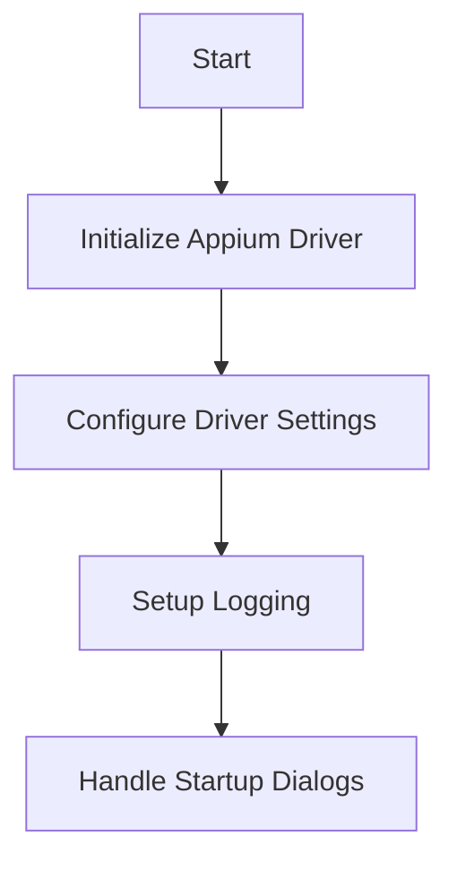
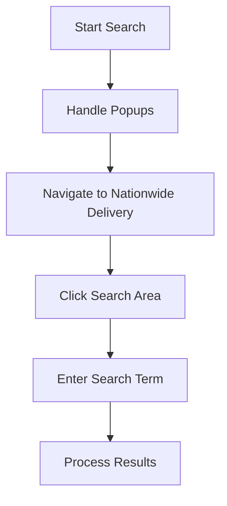
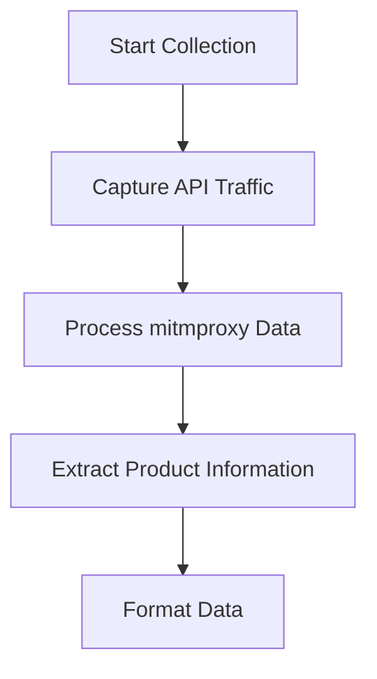
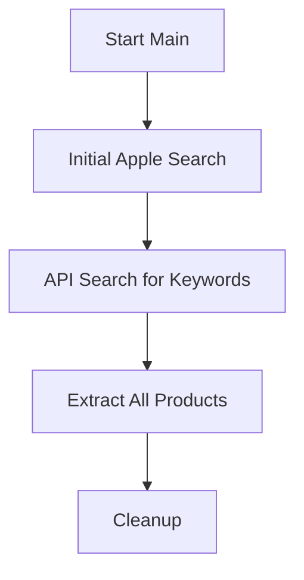

# Pagoda App Automation Workflow Documentation

## Overview

This automation system is designed to search and extract product information from the Pagoda (百果园) mobile application using Appium for UI automation and mitmproxy for API capture.

## Prerequisites

1. Android Emulator (MuMu) running on 127.0.0.1:7555
2. Appium Server running on localhost:4723
3. mitmproxy installed and configured
4. Pagoda app (com.pagoda.buy) installed on the emulator

## Detailed Workflow

### 1. Initial Setup

1. **Driver Initialization**

   - Creates Appium WebDriver with Android UiAutomator2
   - Configures device capabilities for MuMu emulator
   - Sets up automatic permission handling

2. **Driver Settings**

   - Configures image recognition settings
   - Enables automatic element position updates

3. **Startup Dialog Management**
   - Handles initial "Agree" button if present
   - Handles location selection if present
   - Handles specific store location selection if needed

### 2. Search Process

1. **Popup Management**

   - Detects popup dialogs using image recognition
   - Automatically closes popups if found

2. **Navigation**

   - Navigates to "全国送" (nationwide delivery) section
   - Uses both image and text-based element location
   - Waits for elements with timeout handling

3. **Search Execution**
   - Clicks search input area
   - Enters search term
   - Handles search history if available

### 3. Data Collection

1. **Traffic Capture**

   - Uses mitmproxy to capture API responses
   - Stores traffic in "traffic.flow" file

2. **Data Processing**

   - Reads mitmproxy capture file
   - Filters for relevant API responses
   - Parses JSON response data

3. **Product Data Extraction**
   - Extracts detailed product information:
     - Product name
     - Price
     - Weight/Specifications
     - Delivery information
     - Labels and tags
     - Images
     - Product IDs

### 4. Main Execution Flow

1. **Initial Search**

   - Performs initial search for "苹果" (apple)
   - Captures API patterns and responses

2. **Extended Search**

   - Uses `search_all_keywords()` for additional terms
   - Processes multiple product categories

3. **Data Extraction**

   - Calls `extract_all_products()` for comprehensive data
   - Formats and stores product information

4. **Cleanup**
   - Closes driver connections
   - Finalizes logging

## Error Handling

- Custom exceptions for navigation and API errors
- Comprehensive logging at multiple levels
- Retry mechanisms for unreliable operations
- Graceful failure handling with cleanup

## Output

The system produces:

1. Structured product data including:
   - Basic product information
   - Pricing details
   - Delivery information
   - Product categorization
2. Detailed logs for:
   - Operation progress
   - HTTP requests
   - Errors and exceptions

## Best Practices

1. Always ensure the emulator is running before starting
2. Monitor the logs for any issues
3. Regular cleanup of capture files
4. Verify network connectivity for API capture
5. Handle the automation session cleanup properly

## Code Structure

The automation system is organized into several key components:

1. **Main Class: PagodaSearch**

   - Handles all core automation functionality
   - Manages driver lifecycle
   - Implements search and data extraction logic

2. **Error Handling**

   - `NavigationError`: Custom exception for navigation failures
   - `PagodaAPIError`: Custom exception for API-related issues

3. **Helper Functions**

   - `wait_and_find_element`: Reliable element location
   - `find_elements_by_image`: Image-based element detection
   - `handle_popups`: Popup dialog management
   - `extract_product_data`: Data extraction utilities

4. **Integration Points**
   - Appium for UI automation
   - mitmproxy for API traffic capture
   - Logging system for operation tracking
   - File system for data storage

## Maintenance and Updates

1. **Regular Updates Required For:**

   - Element locators if app UI changes
   - API response parsing if data structure changes
   - Image references for popup detection
   - Emulator and app version compatibility

2. **Monitoring Points:**
   - Success rate of searches
   - API response patterns
   - Error frequency and types
   - Performance metrics

## Troubleshooting Guide

1. **Common Issues:**

   - Emulator connection failures
   - Element location timeouts
   - API capture misses
   - Popup handling failures

2. **Resolution Steps:**
   - Check emulator status and connectivity
   - Verify Appium server is running
   - Ensure mitmproxy is properly configured
   - Review logs for error patterns
   - Update element locators if needed

## Future Enhancements

1. **Potential Improvements:**
   - Add support for multiple emulators
   - Implement parallel search processing
   - Enhance data validation
   - Add automated reporting
   - Implement retry strategies for failed searches
